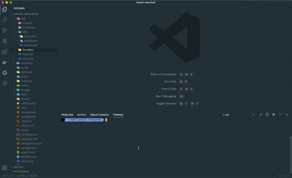

# Laravel Resources

<p align="center">
    
</p>

<p align="center">
    
    
    
    
    
    
    
    

</p>

---

Laravel Resources is a speed-up development package that allows you to create a boilerplate for Laravel apps with a default API structure.

## Installation

Via Composer

```bash
$ composer require tiagomichaelsousa/laravelresources --dev
```

## Usage

Create the resources

```bash
$ php artisan resources:create <model>
```

This command will create the Controller, the Request, the Policy, the API Resource and Collection and will also add the default routes for the API.

Publish configuration file

```bash
$ php artisan vendor:publish --provider="tiagomichaelsousa\LaravelResources\LaravelResourcesServiceProvider" --tag="config"
```

**Notes:**

- This package is fully configurable. You can change all the namespaces for the resources that will be created in the config file.
- Don't forget to edit the request file in order to add your default validation for the model.
- Don't forget to edit the policy file in order to fulfill your app business logic.

## Change log

Please see the [changelog](changelog.md) for more information on what has changed recently.

## Testing

```bash
$ composer test
```

### With test coverage

```bash
$ composer test-report
```

## Contributing

Please see [contributing.md](contributing.md) for details and a todolist.

## Security

If you discover any security related issues, please email the [author](mailto:tiagomichaelsousa@gmail.com) instead of using the issue tracker.

## Credits

- [@tiagomichaelsousa][link-author]
- [All Contributors][link-contributors]

## License

License MIT. Please see the [license file](license.md) for more information.

## Code Of Conduct

Please see the [code of conduct](code_of_conduct.md) for more information.

[ico-version]: https://img.shields.io/packagist/v/tiagomichaelsousa/laravelresources.svg?style=flat-square
[ico-downloads]: https://img.shields.io/packagist/dt/tiagomichaelsousa/laravelresources.svg?style=flat-square
[ico-travis]: https://img.shields.io/travis/tiagomichaelsousa/laravelresources/master.svg?style=flat-square
[ico-styleci]: https://github.styleci.io/repos/236964942/shield
[link-packagist]: https://packagist.org/packages/tiagomichaelsousa/laravelresources
[link-downloads]: https://packagist.org/packages/tiagomichaelsousa/laravelresources
[link-travis]: https://travis-ci.org/tiagomichaelsousa/laravelresources
[link-styleci]: https://styleci.io/repos/236964942
[link-author]: https://github.com/tiagomichaelsousa
[link-contributors]: ../../contributors

## Contributors ✨

Thanks goes to these wonderful people ([emoji key](https://allcontributors.org/docs/en/emoji-key)):

<!-- ALL-CONTRIBUTORS-LIST:START - Do not remove or modify this section -->
<!-- prettier-ignore-start -->
<!-- markdownlint-disable -->
<table>
  <tr>
    <td align="center"><a href="http://www.xgeeks.io"><br /><sub><b>Rafael Ferreira</b></sub></a><br /><a href="https://github.com/tiagomichaelsousa/LaravelResources/commits?author=RafaelFerreiraTVD" title="Documentation">📖</a></td>
    <td align="center"><a href="https://github.com/tiagomichaelsousa"><br /><sub><b>tiagomichaelsousa</b></sub></a><br /><a href="https://github.com/tiagomichaelsousa/LaravelResources/commits?author=tiagomichaelsousa" title="Code">💻</a> <a href="https://github.com/tiagomichaelsousa/LaravelResources/commits?author=tiagomichaelsousa" title="Documentation">📖</a> <a href="#content-tiagomichaelsousa" title="Content">🖋</a> <a href="https://github.com/tiagomichaelsousa/LaravelResources/pulls?q=is%3Apr+reviewed-by%3Atiagomichaelsousa" title="Reviewed Pull Requests">👀</a></td>
    <td align="center"><a href="https://github.com/white-hyena"><br /><sub><b>White Hyena</b></sub></a><br /><a href="https://github.com/tiagomichaelsousa/LaravelResources/commits?author=white-hyena" title="Code">💻</a> <a href="#content-white-hyena" title="Content">🖋</a></td>
  </tr>
</table>

<!-- markdownlint-enable -->
<!-- prettier-ignore-end -->
<!-- ALL-CONTRIBUTORS-LIST:END -->

This project follows the [all-contributors](https://github.com/all-contributors/all-contributors) specification. Contributions of any kind welcome!
